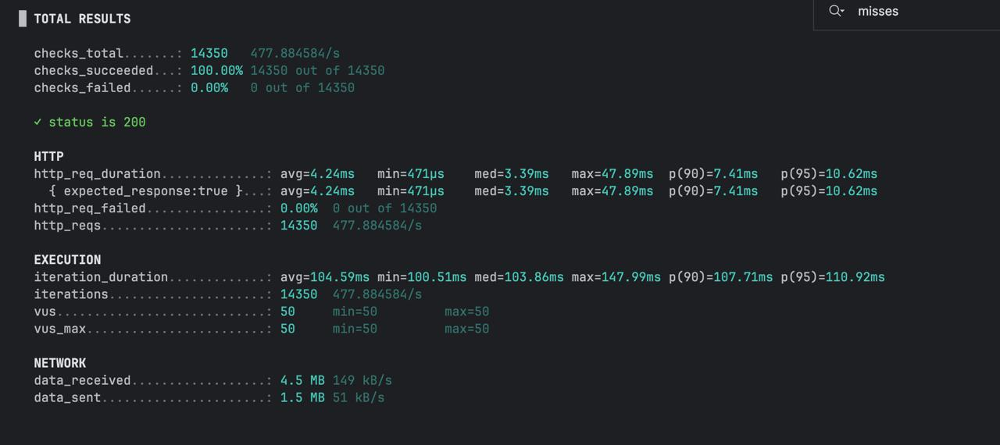
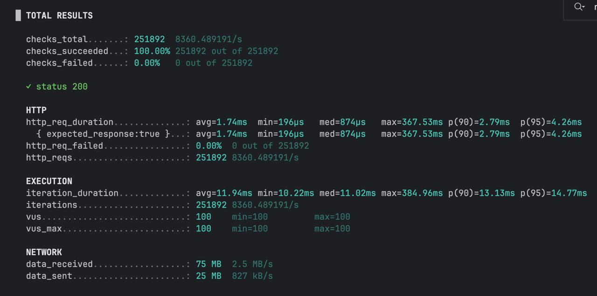

# Redis Cache Performance Test

This project demonstrates different caching strategies for improving backend performance in a Spring Boot application.

The goal of the experiment is to compare three approaches:

* **Direct database access (no cache)**
* **Manual Redis caching implementation**
* **Spring Cache abstraction using annotations**

Load testing was performed using **k6**.

---

# Tech Stack

* Spring Boot
* PostgreSQL
* Redis
* Docker
* k6 (load testing)

---

# Caching Strategies Implemented

## 1. No Cache

The service directly queries the database for every request.

```text
Request
   ↓
Spring Boot
   ↓
Hibernate
   ↓
PostgreSQL
```

---

## 2. Manual Redis Cache

A manual **cache-aside pattern** implementation using `RedisTemplate`.

Flow:

```text
Request
   ↓
Check Redis
   ↓
Cache hit → return cached value
Cache miss → query database
   ↓
Store result in Redis
   ↓
Return response
```

Key logic example:

```java
val objFromCache = redisTemplate.opsForValue().get(cacheKey)

if (objFromCache != null) {
    return objFromCache
}

val entityFromDb = productRepository.findById(productId)
redisTemplate.opsForValue().set(cacheKey, entityFromDb)
```

---

## 3. Spring Cache Annotations

The same caching behavior implemented using Spring Cache abstraction:

* `@Cacheable`
* `@CacheEvict`

Example:

```java
@Cacheable("product")
fun getById(productId: Long): ProductEntity
```

Cache invalidation:

```java
@CacheEvict("product", key = "#id")
fun update(id: Long, request: ProductUpdateRequest)
```

This approach significantly simplifies caching logic and removes manual Redis interaction.

---

# Load Testing

Performance tests were executed using **k6**.

Test configuration example:

```javascript
export const options = {
    vus: 100,
    duration: '30s',
};
```

Requests randomly query product IDs through the API.

---

# Test Results

All benchmark results are stored in:

```
load-test/results/
```

---

## Database Only



Metrics:

* Average latency: **4.24 ms**
* p95 latency: **10.62 ms**
* Throughput: **~478 requests/sec**

---

## Redis Cache

Without annotations:


With annotations:


Metrics:

* Average latency: **1.63 ms**
* p95 latency: **4.24 ms**
* Throughput: **~8431 requests/sec**

---

## Spring Cache (Annotation-Based Implementation)

The same test was executed using the service implemented with Spring Cache annotations (`@Cacheable`, `@CacheEvict`).
The results of this benchmark are also stored in the `load-test/results` directory.

---

# Performance Comparison

| Metric      | No Cache   | Redis Cache |
| ----------- | ---------- | ----------- |
| Avg latency | 4.24 ms    | 1.63 ms     |
| p95 latency | 10.62 ms   | 4.24 ms     |
| Throughput  | ~478 req/s | ~8431 req/s |

### Improvement

* **~18x higher throughput**
* **~2.6x lower latency**
* significantly reduced load on PostgreSQL

---

# Running the Project

Start infrastructure:

```
docker compose up -d
```

Run the Spring Boot application.

Execute load test:

```
k6 run load-test/cache-test.js
```

---

# Conclusion

The experiment shows how adding a Redis caching layer dramatically improves backend performance by:

* reducing database load
* decreasing response latency
* increasing system throughput

Additionally, the project demonstrates how the same caching logic can be implemented both:

* manually using Redis
* declaratively using Spring Cache annotations
