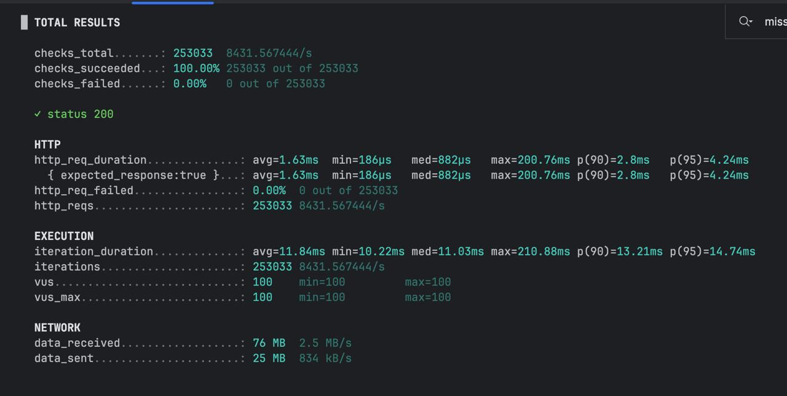

# Redis Cache Performance Test

This repository contains a simple performance experiment demonstrating the impact of Redis caching on a Spring Boot service.

The goal of the test is to compare:

* **Database-only access (PostgreSQL)**
* **Manual Redis cache (cache-aside pattern)**

Load testing was performed using **k6**.

---

# Architecture

Backend stack:

* Spring Boot
* PostgreSQL
* Redis
* Docker
* k6 for load testing

Caching strategy used in the project:

```
Cache Aside Pattern
```

Flow with cache:

```
Request
   ↓
Check Redis
   ↓
Cache hit → return value
   ↓
Cache miss → query PostgreSQL
   ↓
Store value in Redis
   ↓
Return result
```

---

# API Endpoints Used for Testing

```
GET /products/{id}?cacheMode=NONE_CACHE
GET /products/{id}?cacheMode=MANUAL
```

Modes:

* `NONE_CACHE` → direct database access
* `MANUAL` → Redis cache enabled

---

# Load Testing

Load testing was performed using **k6**.

Configuration example:

```
vus: 100
duration: 30s
```

Random product IDs are requested during the test.

Test script:

```
load-test/cache-test.js
```

---

# Results

Results are stored in:

```
load-test/results/
```

### Without Redis Cache


Key metrics:

* Average latency: **4.24 ms**
* p95 latency: **10.62 ms**
* Throughput: **~478 requests/sec**

---

### With Redis Cache



Key metrics:

* Average latency: **1.63 ms**
* p95 latency: **4.24 ms**
* Throughput: **~8431 requests/sec**

---

# Performance Comparison

| Metric      | No Cache   | Redis Cache |
| ----------- | ---------- | ----------- |
| Avg latency | 4.24 ms    | 1.63 ms     |
| p95 latency | 10.62 ms   | 4.24 ms     |
| Throughput  | ~478 req/s | ~8431 req/s |

### Improvement

* **~18x higher throughput**
* **~2.6x lower latency**

---

# How to Run the Test

Start infrastructure:

```
docker compose up -d
```

Run backend application.

Run load test:

```
k6 run load-test/cache-test.js
```

---

# Conclusion

Even with a simple manual caching implementation, Redis significantly improves system performance:

* higher request throughput
* lower response latency
* reduced load on the database

This demonstrates why Redis is commonly used as a caching layer in high-load backend systems.
